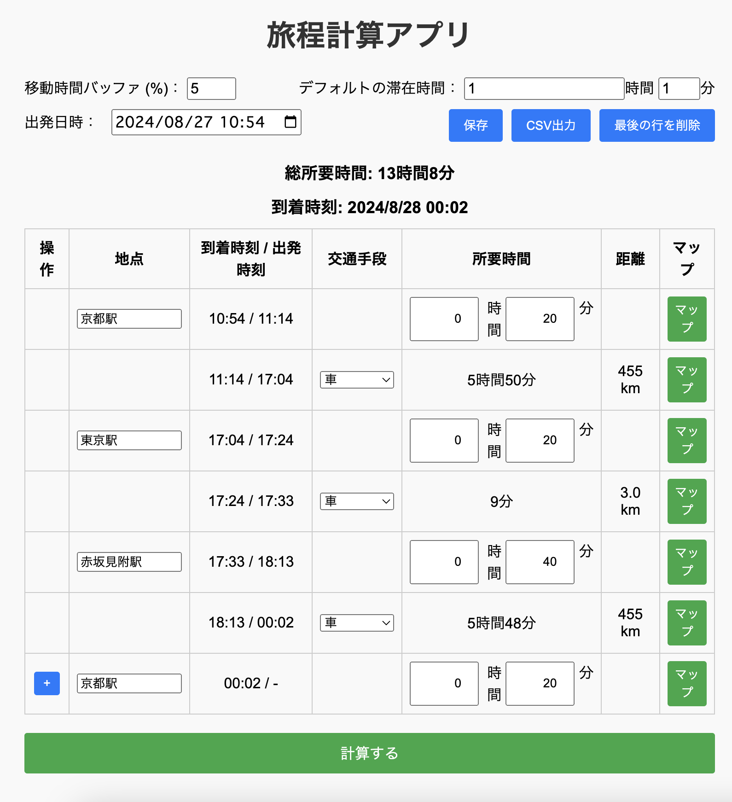
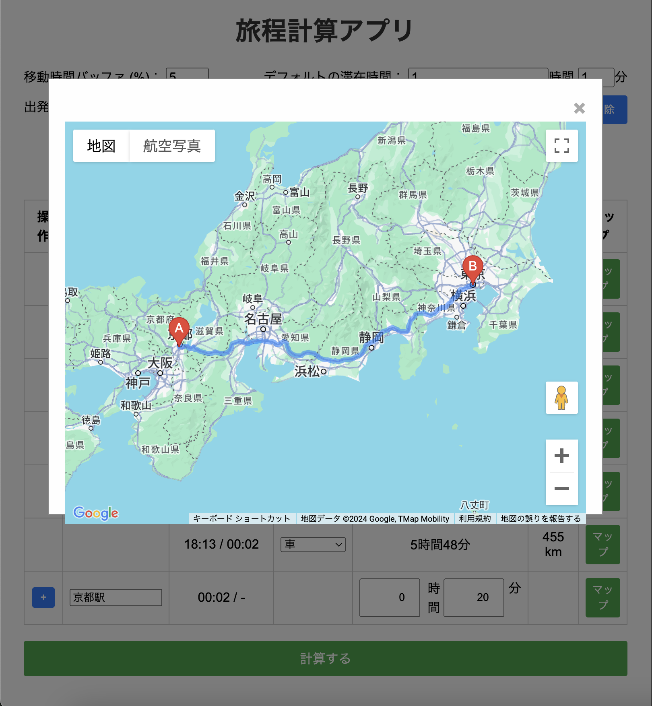

## ①課題番号-プロダクト名

旅程計算アプリ

## ②課題内容（どんな作品か）

### 行きたい場所と交通手段を入力するだけで、所要時間を算出して旅程を自動作成してくれるアプリ

- 行きたい場所と交通手段をを入力すると、地点間の移動時間を自動的に表示
  - GoogleのAPIを使用して、地点間の所要時間を取得
- 開始日時を指定することで、旅程のスケジュールを自動作成
- 入力内容はローカルストレージに保存されるため、都度入力し直す必要がない
- 作成内容をCSV形式でダウンロードできる
- 入力地点のマップをGoogleマップでページ内にポップアップ表示可能
- 地点間の移動経路をGoogleマップでページ内にポップアップ表示可能

## ③DEMO

https://tech-ryu.sakura.ne.jp/travel-app/

## ④作ったアプリケーション用のIDまたはPasswordがある場合

特になし

## ⑤工夫した点・こだわった点

- 旅行の時に行きたい場所の名前と滞在時間を入力するだけで、自動で旅程を作成できるようにした点
- GoogleのDistance Matrix APIとMaps JavaScript APIを使用し、地点を入れるだけで自動で旅程を作成できるようにした
- Google Cloud functionを使用して、CORSエラーを回避してDistance Matrix APIのリクエストを送信できるようにした
  - APIキーを直接公開せず、クライアント側からのリクエストを受け取り、APIキーを使用してリクエストを送信する
  （Maps APIについては、今回はAPI_KEYが取得出来る状態になっている）
- ローカルストレージを利用して、入力内容を保存・復元できるようにしている
- 作成した旅程をCSV形式でダウンロードできるようにしたところ

## ⑥難しかった点・次回トライしたいこと(又は機能)

### 難しかった点

- Google Cloud functionを使用して、APIキーを隠蔽してリクエストを送信する方法
  - 最初は、Google Cloud functionのデプロイ方法がわかりにくかった
- 可変長の入力フォームを作成するところ
  - 柔軟に入力データの追加・削除を実装したかったが、配列の要素の追加・削除がうまくいかず、苦労した
  - 今回は、最後の要素のみ追加・削除できるようにしている（将来的には途中の要素を削除・追加する機能も実装したい）
- GoogleのDistance Matrix APIを使用するときに、CORSエラーが出てしまったところ
    - Googleの一部APIは、フロントから直接のアクセスを許可していないため、ブラウザ側でCORSエラーが出てしまった
    - CORSエラーを回避するためには、サーバ側のレスポンスにAccess-Control-Allow-Originヘッダを追加する必要がある（クライアント側のコードでは対応できない）
    - 今回はGoogle Cloud functionを使用してリクエストを行うことで、CORSエラーを回避した（次回の講義のPHPではサーバ再度プログラムも作成するため、問題になら無いと思われる）

### 次回トライしたいこと

- 移動時間計算のAPIをDistance Matrix APIから、Google Maps PlatformのDirections APIに変更
  - 現状では、日本の公共交通機関の情報を取得出来ないため
- 地点の追加・削除機能のアップデート
- ユーザ認証機能、cloudへのデータ保存機能の追加
  
## ⑦質問・疑問・感想、シェアしたいこと等なんでも

- [質問]
- [感想]
  - 途中でJavaScriptの疎な配列（Sparse Arrays）？と思われる事象に遭遇し、かなりエラー対応に時間がかかってしまった。（直接的な要因がわからなかったので、最終的にはデータの保存方法を1から見直した）
    - 配列の長さは10なのに、実際のデータが20個あるなどの現象が起きる
    - 長さはあるけど要素が（一部、もしくは全て）存在しない配列がある。ループやメソッドを扱う時、予期しない動作が起きてしまう。
- [参考記事]